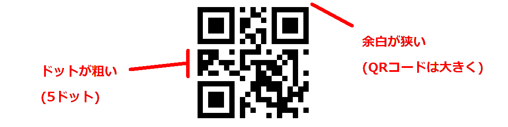

# Tiny View Plus Practice

practice.png

Tiny View Plus Practiceは、Tiny View PlusのARマーカを利用したタイム計測表示を強化した練習会用のアプリです。


<font color="crimson">ここに記載していない部分は　Tiny View Plus を参照してください。</font>

[https://github.com/t-asano/tinyviewplus](https://github.com/t-asano/tinyviewplus)


## 動作環境

<table>
<tr>
<td>OS</td><td>Windows (10 64bit推奨)</td>
</tr>
<tr>
<td>受信機</td><td>Eachine ROTG02<br/>Eachine ROTG01</td>
</tr>
</table>


## インストール

### ビルド済みバイナリを使用する場合(通常はこちら)

1. [リリースページ](https://github.com/chibaron/tinyviewpluspractice/releases)よりzipファイルをダウンロード
2. zipファイルを展開して適当な場所に配置

バイナリの作成にあたっては細心の注意を払っていますが、アプリを実行することで起こる不具合については、一切責任を負いません。


## 使い方

### キー操作

| キー | 機能 | 初期値 |
|---|---|---|
| H | ヘルプの表示 | - |
| A | 基準タイム設定 | 10秒 |
| M | 最小ラップタイムの設定(1~100秒) | 3秒 |
| S | セッションタイムアウトの設定 | 120秒 ※|
| Tab | 項目選択 | - |
| Up | 項目内スクロール | - |
| Down | 項目内スクロール| - |
| Left | 項目内スクロール | - |
| Right| 項目内スクロール | - |
| . | アプリの終了 | - |

※ マーカーを検出しない場合は初期パイロットに戻ります。


### マウス操作

現在は使用できません。(将来対応予定)

### ラップ表示

| 種別　| 詳細 |
|---|---|
| bestlap | 各パイロット毎の1周の最速タイムです。 赤で表示されます。|
| best3lap | 各パイロット毎の連続した３週の最速タイムです。青で表示されます。|
| 基準タイム | 基準タイム以下の場合は緑で表示されます。|


## QR code reader

QRコードを使用してパイロット登録を行います。２種類の方法があり、QRコードをBeatflightのスプラッシュ画像と入れ替える方法と、スマホで表示されたQRコードをドローンのカメラで撮影する方法があります。

### 1. Betaflight起動時のスプラッシュ画像をQRコードに入れ替え

ドローンの電源投入と同時にOSDに表示されたQRコードを読み取り、パイロット登録されます。(BeebrainLiteなど一部のFCではスプラッシュ画像の入れ替えができないことが確認されています)


1. 下のURLの最後に記述してある'パイロット'をご自身のパイロットIDに書き換えてQRコードを生成します。
https://chart.apis.google.com/chart?cht=qr&chld=H|0&chs=288x72&chl=パイロット
1. 下の画像のようなQRコードでない場合は、一致するまでURLの'chld=H'を書き換えます。

```
chld=H → chld=Q → chld=M → chld=L 
```
1. QRコード画像(png)を保存します。
1. BetaFlightConfigratorで電源投入時のスプラッシュ画像をQRコードに変更します。
OSD→フォントマネージャー(右下ボタン)→カスタム画像を選択→フォントをアップロード


### 2. スマホで表示されたQRコードをドローンのカメラで撮影

1. 下のURLの最後に記述してある'パイロット'をご自身のパイロットIDに書き換えてスマホで表示させます。
https://chart.apis.google.com/chart?cht=qr&chld=H&chs=500x500&chl=パイロット
1. ドローンのカメラでQRコードを撮影します。QRコードがなるべく大きくなるよう、OSDに表示されている文字と重ならないようにしてください。


## License

Tiny View Plus is distributed under the MIT License. This gives everyone the freedoms to use Tiny View Plus in any context: commercial or non-commercial, public or private, open or closed source. Please see [LICENSE.md](LICENSE.md) and [LICENSE\_THIRD\_PARTY.md](LICENSE_THIRD_PARTY.md) for details.
